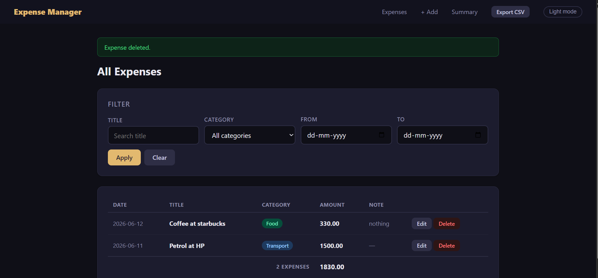

# Expense Manager Report



## 1. Overview
This workspace now contains a single flattened Flask application at the root of the project. The app is a local, server-rendered expense manager backed by SQLite. It supports adding, editing, deleting, filtering, summarizing, and exporting expenses.

The current product name is **Expense Manager**.

## 2. Current Structure
- `app.py` - Flask routes, validation, SQLite access, summary logic, and CSV export
- `templates/` - Jinja templates for the UI
- `static/` - static assets
- `requirements.txt` - Python dependencies
- `.gitignore` - ignores the virtual environment, database file, and bytecode
- `README.md` - usage and project notes
- `PROJECT_SUMMARY.md` - detailed build summary
- `expenses.db` - local SQLite database file
- `.venv/` - local Python environment

## 3. How To Run It
From PowerShell in the workspace root:

```powershell
cd C:\projects\personal_expense_POC
.\.venv\Scripts\Activate.ps1
python app.py
```

Or without activating the virtual environment first:

```powershell
cd C:\projects\personal_expense_POC
.\.venv\Scripts\python.exe app.py
```

Then open:

```text
http://127.0.0.1:5000
```

## 4. Stack Choice and Tradeoffs
### Stack
- Python 3.14
- Flask
- SQLite
- Jinja2 templates
- Vanilla CSS and JavaScript

### Why this stack
- Flask keeps the app small and easy to follow.
- SQLite is enough for a single-user local tracker and avoids database setup.
- Jinja templates keep the UI simple and fast to build.
- Vanilla CSS/JS keeps the project lightweight and easy to edit.

### Tradeoffs
- SQLite is not ideal for multi-user concurrency.
- Currency is stored as `REAL`, which is simple but not perfect for exact financial math.
- The UI is server-rendered rather than SPA-based, so it is less dynamic.
- Validation is intentionally simple to keep the app compact.

## 5. What Is Done
- Add expense form
- Edit expense form
- Delete expense action
- Expense listing sorted by date
- Filters by title, category, and date range
- Monthly summary page
- CSV export
- Light and dark theme toggle
- Basic validation for title, amount, category, and date
- Local SQLite persistence
- Root-level run flow
- GitHub push completed

## 6. What Was Skipped
- Authentication and user accounts, because the brief is for a local POC
- Deployment, because the app is meant to run locally only
- Automated tests, because the goal was to get a working app and documentation first
- API layer, because server-rendered pages were simpler for the scope
- Complex design system, because the UI was intentionally kept basic

## 7. Known Rough Edges
- Amounts are stored as `REAL`, which can be imprecise for currency edge cases.
- There is no CSRF protection yet.
- The app is still local-first and single-user.
- The browser date picker icon can behave differently depending on the browser and theme.
- Some validation is still app-level rather than enforced by the database.
- The secret key is hardcoded for convenience and should be moved to an environment variable for any real deployment.

## 8. Notes On Cleanup
- The project was flattened so the root folder is the real project root.
- The old nested `expense-tracker/` folder was removed.
- Branding was simplified to remove the Riafy reference.
- The UI title now uses the plain name `Expense Manager`.

## 9. Status
The project is in a clean, working state and has already been pushed to GitHub.
